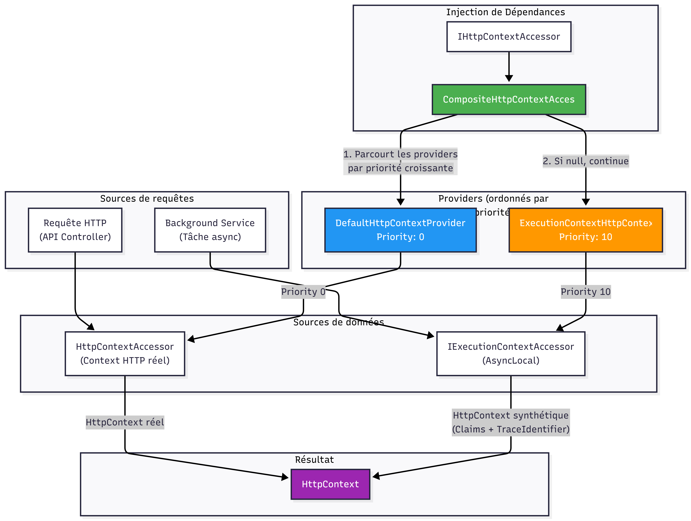
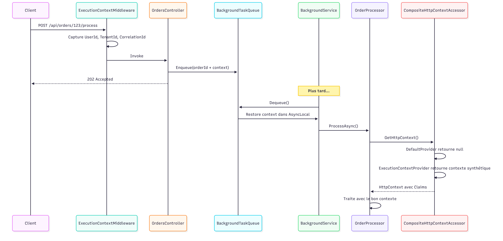

# AsyncLocal-demo

Démonstration d'un contexte d'exécution multi-tenant basé sur `AsyncLocal<T>` (tenant, utilisateur, correlation id) propagé de l'API jusqu'aux services applicatifs.

AsyncLocal<T> est une classe située dans le namespace System.Threading qui représente des données ambiantes locales à un flux de contrôle asynchrone donné. Elle permet de stocker des valeurs qui se propagent automatiquement à travers les appels asynchrones (async/await).

Contrairement à ThreadLocal<T> qui stocke des données par thread, AsyncLocal<T> stocke des données par contexte d'exécution asynchrone. Les valeurs sont :
- ✅ Propagées vers le bas du flux asynchrone (aux méthodes appelées)
- ❌ Non propagées vers le haut (les modifications dans les méthodes enfants n'affectent pas le parent)
- ✅ Isolées entre flux parallèles

Différence clé : AsyncLocal<T> vs ThreadLocal<T>

| Critère | AsyncLocal<T> | ThreadLocal<T> |
|----------|-----------|-----------|
| Portée | Flux asynchrone  | Thread physique  |
| Propagation async | ✅ Oui  | ❌ Non  |
| Isolation parallèle | ✅ Oui  | ⚠️ Partiel  |
| Cas d'usage | Applications modernes async  | Code synchrone legacy |

## Objectifs

- Centraliser les informations de contexte (`TenantId`, `UserId`, `CorrelationId`) pour chaque requête.
- Propager ce contexte de manière sûre à travers les appels asynchrones.
- Montrer l'impact sur la logique métier (création/lecture de commandes) et la testabilité.

## Architecture (vue rapide)

- `package/AsyncLocal.ExecutionContext.Abstractions`
  - Contrats réutilisables (`IExecutionContext`, `IExecutionContextAccessor`, `ISyntheticHttpContextBuilder`).
- `package/AsyncLocal.ExecutionContext`
  - Implémentations du package (`AsyncLocalExecutionContext`, `ExecutionContextAccessor`, `CompositeHttpContextAccessor`).
- `src/AsyncLocal-demo.Api`
  - API ASP.NET Core, configuration du pipeline, middleware de contexte.
- `src/AsyncLocal-demo.Application`
  - Cas d'usage (ex: `OrderService`, `OrderProcessor`) et DTO/commands.
- `src/AsyncLocal-demo.Core`
  - Contrats partagés (ex: `IBackgroundTaskQueue<T>`, `ExecutionContextExtensions`).
- `src/AsyncLocal-demo.Infrastructure`
  - Implémentations techniques (ex: `BackgroundTaskQueue<T>`, `DemoSyntheticHttpContextBuilder`, persistence).
- `tests/AsyncLocal-demo.Tests`
  - Tests unitaires (`ExecutionContextTests`, `CompositeHttpContextAccessorTests`).

## Prérequis

- .NET SDK 10
- Visual Studio 2026 (recommandé)

## Démarrage rapide

### 1) Restaurer / compiler
**PowerShell :**
```powershell
dotnet restore 
dotnet build
```

### 2) Lancer l’API
**PowerShell :**
```powershell
dotnet run --project src/AsyncLocal-demo.Api
```

Swagger est activé en environnement Développement.

### 3) Exécuter les tests
**PowerShell :**
```powershell
dotnet test
```

## Contexte d’exécution

Le contexte d'exécution est exposé via `IExecutionContext` (du package réutilisable) et alimenté côté API par un middleware.

### Extensions spécifiques à la démo

Les propriétés métier (`TenantId`, `UserId`) sont ajoutées via `ExecutionContextExtensions` dans `AsyncLocal-demo.Core` :
```csharp
// Utilisation 
context.GetTenantId(); 
context.SetTenantId("mon-tenant"); 
context.GetUserId(); 
context.SetUserId("user-123");
```

### Règles appliquées par `OrderService`

- `TenantId` est obligatoire → sinon `UnauthorizedAccessException`.
- `CorrelationId` est obligatoire → sinon `InvalidOperationException`.
- `UserId` est optionnel → valeur par défaut `anonyme`.

## Package réutilisable

Le projet inclut un package réutilisable `AsyncLocal.ExecutionContext` qui fournit :

| Composant | Responsabilité |
|-----------|----------------|
| `IExecutionContext` | Interface du contexte d'exécution avec `CorrelationId` et stockage clé/valeur |
| `IExecutionContextAccessor` | Accesseur pour obtenir le contexte courant |
| `AsyncLocalExecutionContext` | Implémentation basée sur `AsyncLocal<T>` |
| `ExecutionContextAccessor` | Wrapper pour accéder au contexte |
| `CompositeHttpContextAccessor` | Fournit un `HttpContext` synthétique pour les services d'arrière-plan |
| `ISyntheticHttpContextBuilder` | Interface pour construire un `HttpContext` personnalisé |

### Enregistrement des services

```csharp
// Dans DependencyInjection.cs 
services.AddExecutionContext<DemoSyntheticHttpContextBuilder>();
```


## **BONUS:** Traitement en arrière-plan (Background Service)

Cette démo inclut un système complet de traitement asynchrone en arrière-plan qui **préserve le contexte d'exécution** (`AsyncLocal<T>`) entre la requête HTTP et le worker.

### Composants clés

| Composant | Responsabilité |
|-----------|----------------|
| `IBackgroundTaskQueue<T>` | Interface de la file d'attente thread-safe |
| `BackgroundTaskQueue<T>` | Implémentation avec `System.Threading.Channels` |
| `IBackgroundWorkItem<T>` | Interface du work item contenant le payload + contexte capturé |
| `OrderProcessingBackgroundService` | `BackgroundService` qui consomme la file et traite les commandes |
| `DemoSyntheticHttpContextBuilder` | Construit un `HttpContext` synthétique avec les claims (TenantId, UserId) |

### Flux de traitement

1. **Capture du contexte** : Lors de l'appel à `EnqueueAsync()`, le contexte courant (`TenantId`, `UserId`, `CorrelationId`) est automatiquement capturé dans un `IBackgroundWorkItem<T>`.

2. **Stockage thread-safe** : L'élément est stocké dans un `Channel<T>` borné (capacité configurable, défaut: 100).

3. **Consommation asynchrone** : Le `BackgroundService` lit les éléments via `ReadAllAsync()`.

4. **Restauration du contexte** : Le `CompositeHttpContextAccessor` fournit un `HttpContext` synthétique construit par `DemoSyntheticHttpContextBuilder`.

### Enregistrement des services
```csharp
// Dans DependencyInjection.cs 
services.AddSingleton<IBackgroundTaskQueue<Guid>>(sp => new BackgroundTaskQueue<Guid>( sp.GetRequiredService<IExecutionContext>(), capacity: 100));
services.AddSingleton<OrderProcessingBackgroundService>(); services.TryAddEnumerable( ServiceDescriptor.Singleton<IHostedService, OrderProcessingBackgroundService>( sp => sp.GetRequiredService<OrderProcessingBackgroundService>()));
```

### Utilisation dans le code
```csharp
// Mise en file d'une commande pour traitement en arrière-plan 
public async Task EnqueueForProcessingAsync(Guid orderId, CancellationToken ct = default) { 
    // Le contexte est automatiquement capturé par la file d'attente 
    await processingQueue.EnqueueAsync(orderId, ct); 
}
```


### Points clés pour la préservation du contexte

`AsyncLocal<T>` ne se propage pas automatiquement aux `BackgroundService` car ils s'exécutent sur des threads séparés du pool.

✅ **Solution implémentée** :
1. Capturer explicitement le contexte lors de `EnqueueAsync()`
2. Stocker les valeurs dans un record immuable (`IBackgroundWorkItem<T>`)
3. Utiliser `CompositeHttpContextAccessor` pour fournir un `HttpContext` synthétique

La propagation d'`AsyncLocal<T>` est liée au **contexte d'exécution (ExecutionContext)**, pas au pool de threads :

| Scénario | Propagation automatique | Explication |
|----------|-------------------------|-------------|
| `await` dans le même flux | ✅ Oui | Le `ExecutionContext` "coule" à travers les continuations asynchrones, **même si le code s'exécute sur des threads différents du pool** |
| `BackgroundService` / `Task.Run` | ❌ Non | Ces méthodes créent une **nouvelle chaîne d'exécution indépendante** qui n'hérite pas du `ExecutionContext` de la requête |

## Endpoints API

| Méthode | Route | Description |
|---------|-------|-------------|
| `POST` | `/api/orders` | Créer une commande |
| `GET` | `/api/orders/{id}` | Obtenir une commande par ID |
| `GET` | `/api/orders` | Lister les commandes (paginé) |
| `POST` | `/api/orders/{id}/process` | Mettre en file pour traitement en arrière-plan |
| `GET` | `/api/orders/context` | Vérifier le contexte d'exécution actuel |
| `GET` | `/api/orders/queue/status` | Vérifier le statut de la file d'attente |

## Exemple (création de commande)
**PowerShell :**
```powershell
curl.exe -X POST https://localhost:7207/api/orders `
  -H "Content-Type: application/json" `
  -H "X-Tenant-Id: dsf" `
  -H "X-User-Id: drm7348" `
  -d '{\"items\": [{\"productId\": \"PORTABLE-001\", \"productName\": \"Dell XPS 15\", \"quantity\": 1, \"unitPrice\": 1499.99},{\"productId\": \"SOURIS-001\", \"productName\": \"Logitech MX\", \"quantity\": 2, \"unitPrice\": 79.99}]}'
```

## Exemple (traitement de la commande)
**PowerShell :**
```powershell
curl.exe -X POST https://localhost:7207/api/orders/123e4567-e89b-12d3-a456-426614174000/process `
  -H "X-Tenant-Id: dsf" `
  -H "X-User-Id: drm7348"
```

## Exemple (vérifier le statut de la commande)
**PowerShell :**
```powershell
curl.exe https://localhost:7207/api/orders/123e4567-e89b-12d3-a456-426614174000 `
  -H "X-Tenant-Id: dsf" `
  -H "X-User-Id: drm7348"
```

## Exemple (vérifier le contexte)
**PowerShell :**
```powershell
curl.exe https://localhost:7207/api/orders/context `
  -H "X-Tenant-Id: dsf" `
  -H "X-User-Id: drm7348"
```

## Exemple (lister les commandes)
**PowerShell :**
```powershell
curl.exe https://localhost:7207/api/orders `
  -H "X-Tenant-Id: dsf"
```

## Exemple (vérifier le statut de la file)
**PowerShell :**
```powershell
curl.exe https://localhost:7207/api/orders/queue/status ` 
  -H "X-Tenant-Id: dsf"
```

## Notes

- Les identifiants utilisent `Guid.CreateVersion7()`.
- Le montant total est calculé à partir des lignes de commande.
- Le `BackgroundService` crée un nouveau scope DI pour chaque élément de travail afin de respecter le cycle de vie des services `Scoped`.
<br/><br/><br/>

<br/><br/><br/>
